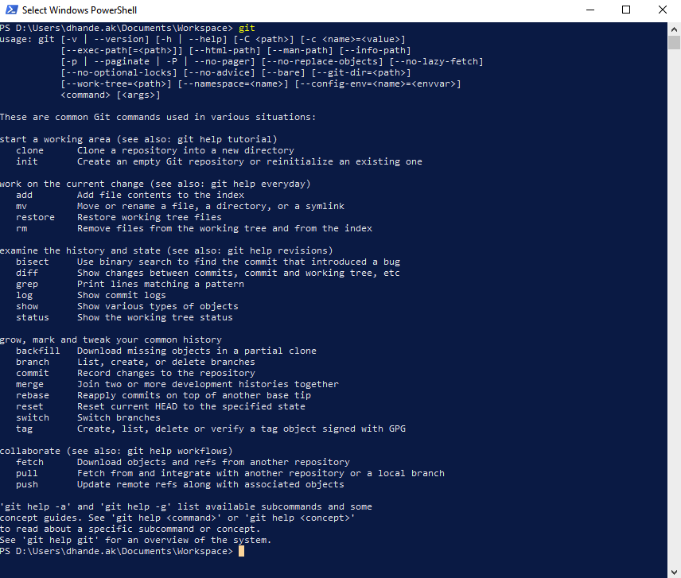

# A Comparative Study of Ischemic vs Hemorrhagic Stroke Patients' Treatment Pathways -
## Team and Stakeholders -
This project was a part of DS5110 - Introduction to Data Management and Processing, offered by Professor [Philip Bogden, PhD](https://roux.northeastern.edu/people/philip-bogden/). 
The project team consist of -
- Akash Dhande
- Omkar Sonar
- Rama Krishna Cavali
- Jermine German

Stakeholder - [Rob Cavanaugh, PhD](https://roux.northeastern.edu/people/rob-cavanaugh/) -- Roux Institute
## Primary Deliverables -
1. [README.md](README.md) - Provides instructions to reproduce the findings of this project, in Amazon Workspaces required for access to the OHDSI Pharmetrics+ Database.
2. [REPORT.md](REPORT.md) - Provides detailed information about the methods and insights achieved in this process.

## Dataset Used - 
The dataset used is the OHDSI Pharmetrics+ database which is a medical and pharmacy claims database consisting of 105,009,000 patients and their claims history. The data used for the scope of this project offered per patient includes information related to -
- Medical Conditions
- Treatment and Diagnosis services taken by the patient. 
- Visits to establishments related to treatments, diagnosis and emergency visits such as Hospitals, Clinics, Laboratories, etc.

The OHDSI Pharmetrics+ Database follows the [OMOP Common Data Model](https://www.ohdsi.org/data-standardization) as a design standard for structuring this large database.

## Reproducibily and Instructions -
The access to OHDSI Pharmetrics+ database is only possible through Amazon Workspaces. The user must have access to Amazon Workspaces to reproduce the following results on it.

### Environment Setup -

#### Download and install Git -
Download the installer from git-scm website - [Download Link](https://github.com/git-for-windows/git/releases/download/v2.47.1.windows.1/Git-2.47.1-64-bit.exe)<br>
This will allow you to use git in Windows Powershell and all further operations can be performed in Powershell itself. It increases simplicity as you do not need to switch to Git Bash terminal for git operations as it is riddled with unkown issues causing it to get stuck multiple times in the Amazon Workspaces.

Double click on the installer file and install with all the recommened/default setup options. By the end of this install you should be able to use `git` command in the Powershell terminal.

(Test if installation was sucessful) After installation is completed in the Windows Powershell window you should be able to run the `git` command and get the following output -



#### Download and install Miniconda -
Download and install Miniconda. The instructions and download links are provided in the official [documentation](https://docs.anaconda.com/miniconda/install/).


#### Install Make -
To ensure reproducibility , we have used make.

While installing make in workspaces , there might be issues related to it's installation.

Follow the below steps to install it properly.

This approach has two steps :

* Installing Chocolatey package installer.
* Installing make using chocolatey package manager. 

#### Installing Chocolatey package installer.

To install make , we will be using chocolatey package installer. Chocolatey is a software management automation tool for Windows that wraps installers, executables, zips, and scripts into compiled packages.

* Navigate to [Official page of chocolatey package installer.](https://chocolatey.org/install)

* Execute the below command in Windows Powershell (Administrator mode).


This will install chocolatey package installer in the amazon workspaces.

To verify if it is properly installed or not , run the below command in the powershell.
```
choco
```
The output must be :

```
Chocolatey v2.4.0
Please run 'choco -?' or 'choco <command> -?' for help menu.
```

Although the version can change , but if you get a similar output , they Chocolatey package installer is successfully installed.

#### Installing make using chocolatey package manager

Now since we have the package installer installed , we can use it to install make.

To do this execute the below command in Windows Powershell (Admin Mode) :

```
choco install make
```

This will install make successfully.

To verify this , open a terminal or Git Bash or Powershell and type the below command :

```
make 
```

You will get the following command that will ensure that make files can be executed properly.

```
make: *** No targets specified and no makefile found.  Stop.
```

Sometimes the changes might not reflect , to do this , restart the terminal or Git Bash or Powershell for the changes to take effect.

### Reproducing the results -
Note: The commands may take a few minutes to run especially if you are running them for the first time, as creating intermediate tables in the database involve some heavy SQL queries.

### Step 1 Create intermediate tables -
Clone this github repository. Update your Amazon Redshift credentials in the config file placed at - `config/config.cfg`. To create the intermediate tables run the following command -
```
make tables
```
### Step 2 Reproduce the EDA -
Run the following command to reproduce the EDA plots -
```
make eda
```
### Step 3 Reproduce the plots from the final report -
The following commands reproduces the charts for patient demographics comparison between ischemic and haemorrhagic stroke.
```
make demographics
```
The following command reproduces the charts for discharge trends between ischemic and haemorrhagic stroke patients
```
make discharges
```

## Resources -
-  [The Book of OHDSI](https://ohdsi.github.io/TheBookOfOhdsi/)
-  [OMOP CDM v5.4 Schema & Table Details](https://ohdsi.github.io/CommonDataModel/cdm54.html)
-  [OHDSI Forum](https://forums.ohdsi.org/)

## References - 
- [Aging and Ischemic Stroke](https://doi.org/10.18632/aging.101931)
- [Cerebral ischemic stroke: is gender important?](https://doi.org/10.1038/jcbfm.2013.102)
- [Gender Differences in Presenting Signs and Symptoms of Acute Ischemic Stroke: A Population-Based Study](https://doi.org/10.1016/j.genm.2011.08.001)