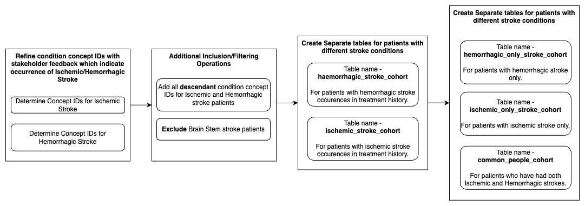

# Overview
Every 40 seconds, someone in the United States suffers a stroke, with 800,000 new cases annually. Stroke survivors face significant challenges, including deficits in mobility, cognition, and independence. Additionally, the care pathway is often fragmented, which hinders the achievement of optimal rehabilitation outcomes.

This project explores the treatment pathways of stroke survivors using the IQVIA Pharmetrics+ dataset—a large commercial health insurance claims database. The focus is on analyzing the types of care provided to patients following a stroke, with particular attention to ischemic and hemorrhagic stroke types.

## Common Data Model

The OMOP Common Data Model (CDM) provides a standardized structure for organizing and analyzing healthcare data. This standardized approach enables researchers to analyze data across different healthcare systems and databases, even when the data originates from diverse sources or regions with differing formats.

## ERD of the Common Data Model 

The OMOP CDM is composed of several core tables that store data, including:

- **Person:** Information about patients (e.g., age, sex, race).
- **Observation Period:** Time frames during which data is available for a patient.
- **Condition Occurrence:** Data on diseases or conditions diagnosed for a patient.
- **Drug Exposure:** Information on the drugs prescribed or administered to patients.
- **Procedure Occurrence:** Data on procedures or treatments that were performed.
- **Measurement:** Observations and laboratory results (e.g., blood pressure, lab test results).

These tables are linked by standardized identifiers, ensuring consistency across datasets and allowing for effective analysis.

## Creating a Cohort

Our cohort creation process began with Casey's cohort, which was then refined to create specific cohorts for ischemic and hemorrhagic stroke patients. During the process, we identified 3,378 patients who exhibited symptoms of both types of stroke, prompting the creation of a separate cohort for these individuals.

### Defining Cohort Inclusion Criteria

We focused on patients with the following concept IDs:

| Stroke Type         | Concept ID | Concept Name               | Code               | Vocabulary | Excluded | Descendants |
|---------------------|------------|----------------------------|--------------------|------------|----------|-------------|
| Ischemic Stroke     | 372924     | Cerebral artery occlusion   | 20059004           | SNOMED     | NO       | YES         |
| Ischemic Stroke     | 375557     | Cerebral embolism           | 75543006           | SNOMED     | NO       | YES         |
| Ischemic Stroke     | 443454     | Cerebral infarction         | 432504007          | SNOMED     | NO       | YES         |
| Ischemic Stroke     | 441874     | Cerebral thrombosis         | 71444005           | SNOMED     | NO       | YES         |
| Ischemic Stroke     | 4310996    | Ischemic stroke             | 422504002          | SNOMED     | NO       | YES         |
| Ischemic Stroke     | 45876543   | Transient ischemic attack - TIA | LA14278-8      | SNOMED     | NO       | YES         |
| Ischemic Stroke     | 4319330    | Brain stem ischemia         | 95456009           | SNOMED     | NO       | YES         |
| Haemorrhagic Stroke | 376713     | Cerebral hemorrage          | 274100004          | SNOMED     | NO       | YES         |
| Haemorrhagic Stroke | 439847     | Intracranial hemorrhage     | 1386000            | SNOMED     | NO       | YES         |
| Haemorrhagic Stroke | 432923     | Subarachnoid hemorrage      | 21454007           | SNOMED     | NO       | YES         |
| Haemorrhagic Stroke | 35609033   | Haemorrhagic stroke         | 1078001000000100   | SNOMED     | NO       | YES         |
| Haemorrhagic Stroke | 4319328    | Brain stem hemorrhage       | 95454007           | SNOMED     | NO       | YES         |

After discussions with our stakeholders, we decided to exclude patients with cryptogenic stroke and brain stem stroke from the analysis. With the finalized concept IDs in hand, we included all their descendant concepts for a broader and more comprehensive dataset.

Next, we focused on the types of visits these patients had by considering:

| Concept ID | Concept Name                         | Code               | Vocabulary | Excluded | Descendants |
|------------|----------------------------|--------------------|------------|----------|-------------|
| 262        | Emergency Room and Inpatient Visit   | 20059004           | Visit     | NO       | YES         |
| 9203       | Emergency Room Visit                 | 20059004           | Visit     | NO       | YES         |
| 9201       | Inpatient Visit                      | 20059004           | Visit     | NO       | YES         |

### Data Filtering

To ensure the accuracy of our cohort, we filtered the dataset based on the occurrence of the stroke. We specifically looked for patients who had at least 6 months of observation before and after the first stroke occurrence. This time frame was chosen to confirm the presence of the stroke and ensure comprehensive data capture.

Additionally, we only included patients who were aged 18 or older at the time of the stroke, further refining our dataset.

### Final Cohorts

After completing the data filtration process, we created two distinct cohorts based on the type of stroke: hemorrhagic and ischemic. We also observed that some patients exhibited symptoms of both stroke types. To streamline our approach and avoid overlap, we established mutually exclusive cohorts for:

- Hemorrhagic stroke
- Ischemic stroke
- Both ischemic and hemorrhagic strokes

This methodology allowed us to focus on the most relevant data and ensure that each cohort was well-defined and distinct.

# Key Findings

We analyzed transitions across treatment locations such as inpatient rehabilitation and emergency room visits.
We also identified patterns of care for stroke subtypes, such as Ischemic and Hemorrhagic strokes.

Stroke care transitions are a critical area for improving patient outcomes, yet gaps in data and understanding make it challenging to optimize care. By refining the original project scope to focus on specific pathways and treatment types, this analysis provides insights that can inform rehabilitation protocols.

There is a direct relationship between age and stroke risk; as people age, they become more susceptible to experiencing strokes.

## Challenges and Lessons Learned
1. Data Limitations:
Insurance Claims data lacks direct measures of patient outcomes like mortality rates, recurrence of strokes, or quality of life improvements.
Data irregularities posed challenges in creating standardized comparisons and finalizing conclusions.
2. Time Constraints:
The compressed project timeline limited the extent of data exploration.
Considering the size of the database, large, interconnected tables required significant time for querying and analysis.
3. Scope Refinement:
Shifting focus from broad care transitions to analyzing specific treatment pathways related to different kinds of therapies, allowed for actionable insights.

# Conclusion
This project represents an initial foray into analyzing healthcare claims data to better understand stroke survivor care. The findings shed light on the treatment journeys of stroke survivors, laying the groundwork for further exploration. Future work could incorporate machine learning techniques to classify pathways and identify key factors driving differences in outcomes.