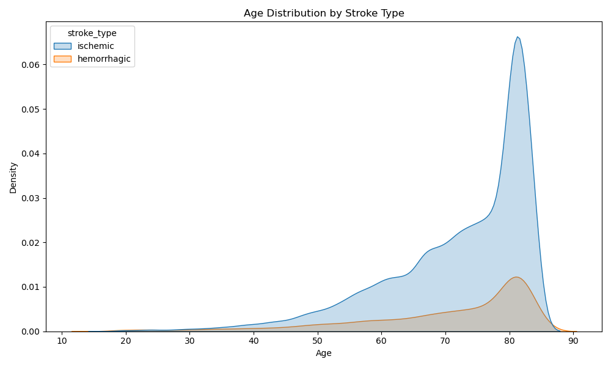
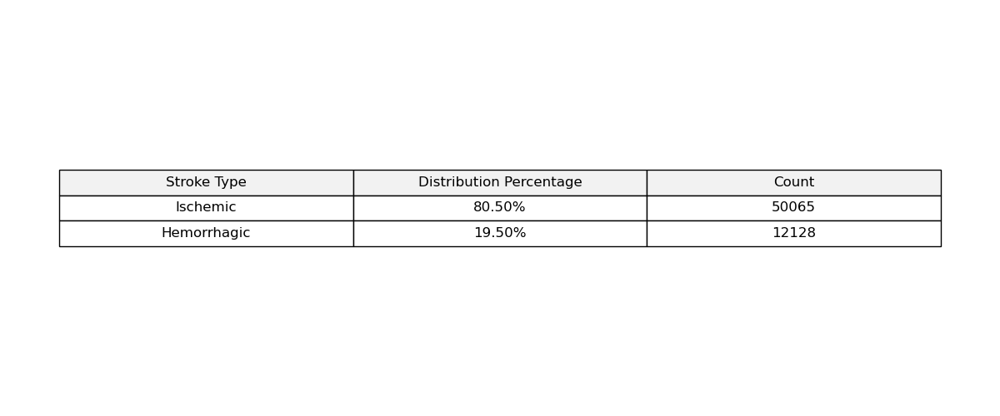
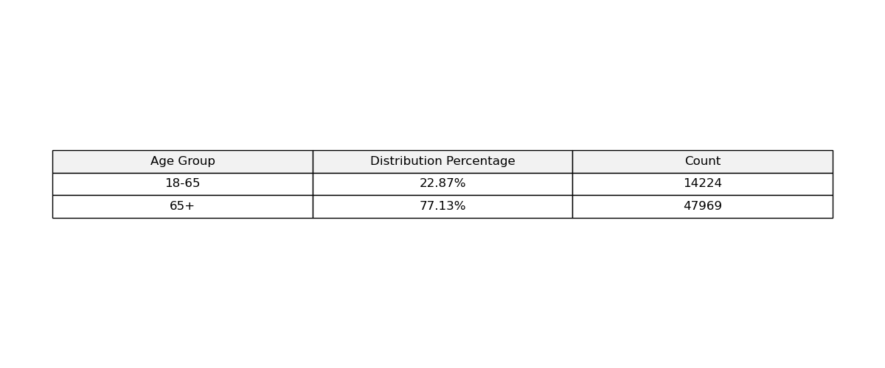
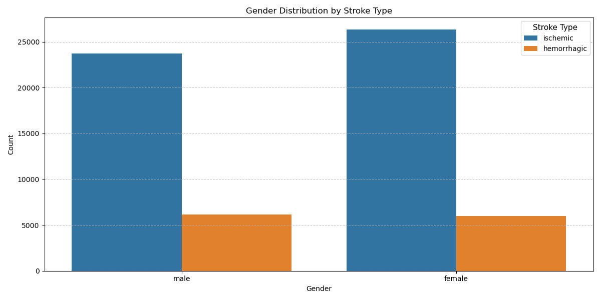
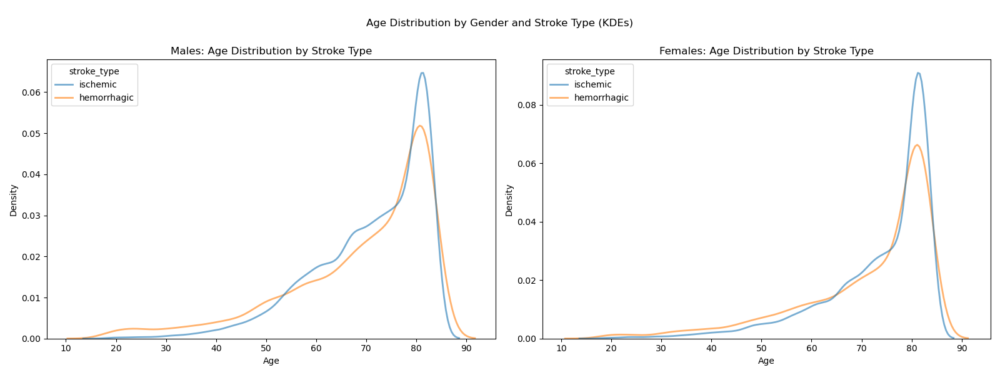
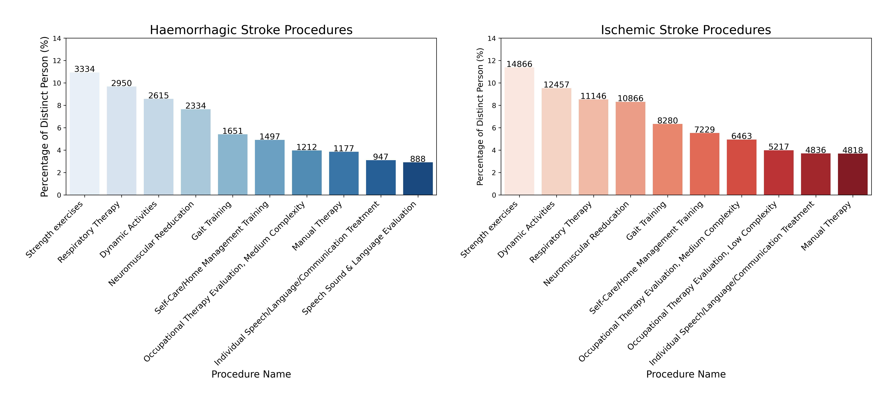
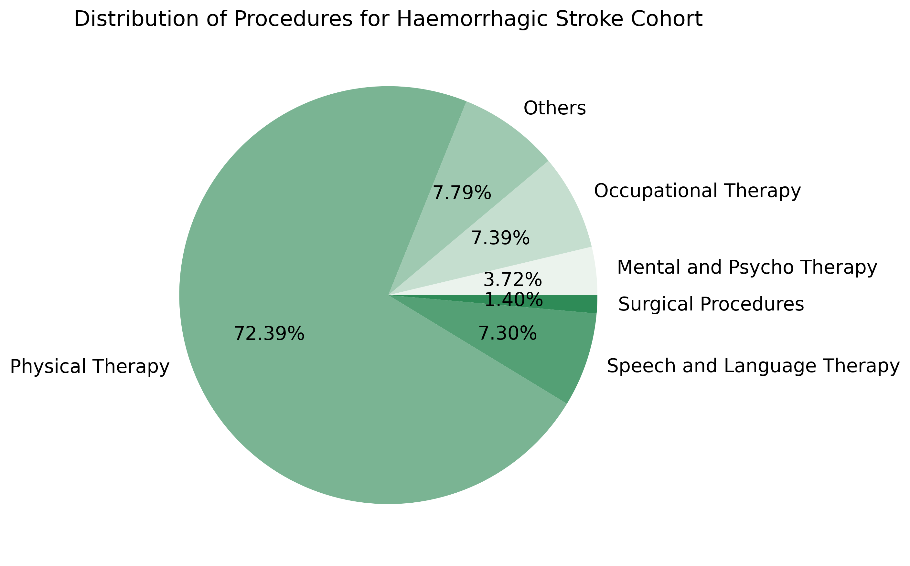
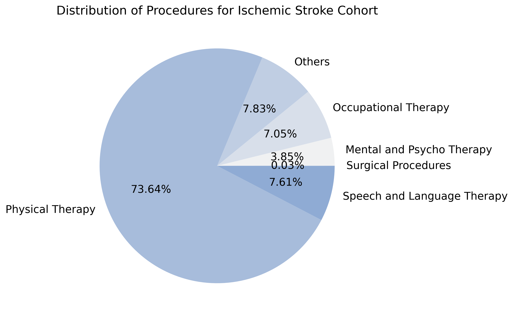
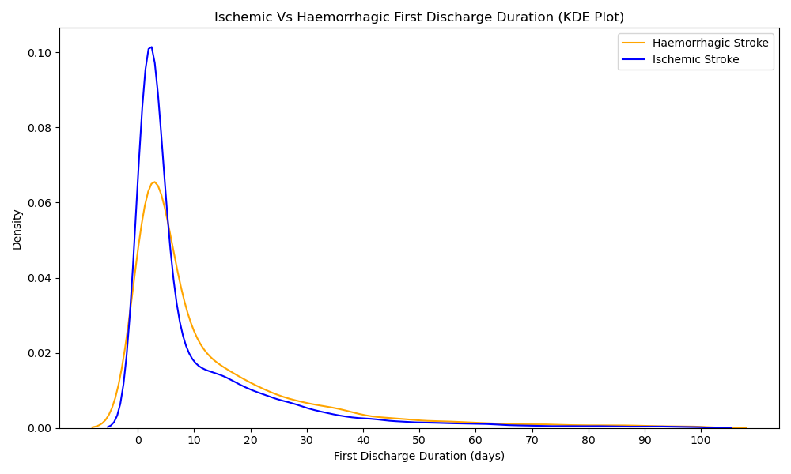

# Overview
- [Common Data Mode](#common-data-model)
- [ERD of the Common Data Model](#erd-of-the-common-data-model)
- [Creating a Cohort](#creating-a-cohort)
   - [Defining Cohort Inclusion Criteria](#defining-cohort-inclusion-criteria)
   - [Data Filtering](#data-filtering)
   - [Final Cohorts](#final-cohorts)
- [Key Findings](#key-findings)
   - [1. Demographics](#1-demographics)
   - [2. Study of Stroke Treatment Procedures](#2-study-of-stroke-treatment-procedures)
   - [3. Patient Discharge Duration](#3-patient-discharge-duration)
- [Challenges and Lessons Learned](#challenges-and-lessons-learned)
- [Conclusion](#conclusion)

Every 40 seconds, someone in the United States suffers a stroke, with 800,000 new cases annually. Stroke survivors face significant challenges, including deficits in mobility, cognition, and independence. Additionally, the care pathway is often fragmented, which hinders the achievement of optimal rehabilitation outcomes.

This project explores the treatment pathways of stroke survivors using the IQVIA Pharmetrics+ dataset—a large commercial health insurance claims database. The focus is on analyzing the types of care provided to patients following a stroke, with particular attention to ischemic and hemorrhagic stroke types.

## Common Data Model

The OMOP Common Data Model (CDM) provides a standardized structure for organizing and analyzing healthcare data. This standardized approach enables researchers to analyze data across different healthcare systems and databases, even when the data originates from diverse sources or regions with differing formats.

## ERD of the Common Data Model 

The OMOP CDM is composed of several core tables that store data, including:

- **Person:** Information about patients (e.g., age, sex, race).
- **Observation Period:** Time frames during which data is available for a patient.
- **Condition Occurrence:** Data on diseases or conditions diagnosed for a patient.
- **Drug Exposure:** Information on the drugs prescribed or administered to patients.
- **Procedure Occurrence:** Data on procedures or treatments that were performed.
- **Measurement:** Observations and laboratory results (e.g., blood pressure, lab test results).

These tables are linked by standardized identifiers, ensuring consistency across datasets and allowing for effective analysis.

## Creating a Cohort

Our cohort creation process began with Casey's cohort, which was then refined to create specific cohorts for our project goal.

### Defining Cohort Inclusion Criteria

We focused on patients with the following concept IDs:

| Stroke Type         | Concept ID | Concept Name               | Code               | Vocabulary | Excluded | Descendants |
|---------------------|------------|----------------------------|--------------------|------------|----------|-------------|
| Ischemic Stroke     | 372924     | Cerebral artery occlusion   | 20059004           | SNOMED     | NO       | YES         |
| Ischemic Stroke     | 375557     | Cerebral embolism           | 75543006           | SNOMED     | NO       | YES         |
| Ischemic Stroke     | 443454     | Cerebral infarction         | 432504007          | SNOMED     | NO       | YES         |
| Ischemic Stroke     | 441874     | Cerebral thrombosis         | 71444005           | SNOMED     | NO       | YES         |
| Ischemic Stroke     | 4310996    | Ischemic stroke             | 422504002          | SNOMED     | NO       | YES         |
| Ischemic Stroke     | 45876543   | Transient ischemic attack - TIA | LA14278-8      | SNOMED     | NO       | YES         |
| Ischemic Stroke     | 4319330    | Brain stem ischemia         | 95456009           | SNOMED     | NO       | YES         |
| Haemorrhagic Stroke | 376713     | Cerebral hemorrage          | 274100004          | SNOMED     | NO       | YES         |
| Haemorrhagic Stroke | 439847     | Intracranial hemorrhage     | 1386000            | SNOMED     | NO       | YES         |
| Haemorrhagic Stroke | 432923     | Subarachnoid hemorrage      | 21454007           | SNOMED     | NO       | YES         |
| Haemorrhagic Stroke | 35609033   | Haemorrhagic stroke         | 1078001000000100   | SNOMED     | NO       | YES         |
| Haemorrhagic Stroke | 4319328    | Brain stem hemorrhage       | 95454007           | SNOMED     | NO       | YES         |
|Brain Stem Stroke	  |4201421	   |Brain stem vertigo	         |51568001	          |SNOMED	   |YES	      |YES          |

After discussions with our stakeholder, Rob, we decided to exclude patients with cryptogenic stroke and brain stem stroke from the analysis. With the finalized concept IDs in hand, we included all their descendant concepts for a broader and more comprehensive dataset.

Next, we focused on the types of visits these patients had by considering:

| Concept ID | Concept Name                         | Code               | Vocabulary | Excluded | Descendants |
|------------|----------------------------|--------------------|------------|----------|-------------|
| 262        | Emergency Room and Inpatient Visit   | 20059004           | Visit     | NO       | YES         |
| 9203       | Emergency Room Visit                 | 20059004           | Visit     | NO       | YES         |
| 9201       | Inpatient Visit                      | 20059004           | Visit     | NO       | YES         |

### Data Filtering

To ensure the accuracy of our cohort, we filtered the dataset based on the occurrence of the stroke. We specifically looked for patients who had at least 6 months of observation before and after the first stroke occurrence. This time frame was chosen to confirm the presence of the stroke and ensure comprehensive data capture.

Additionally, we only included patients who were aged 18 or older at the time of the stroke, further refining our dataset.

### Final Cohorts

After completing the data filtration process, we created two distinct cohorts based on the type of stroke: hemorrhagic and ischemic. We also observed that some patients exhibited symptoms of both stroke types. To streamline our approach and avoid overlap, we established mutually exclusive cohorts for:

- Hemorrhagic stroke
- Ischemic stroke
- Both ischemic and hemorrhagic strokes

This methodology allowed us to focus on the most relevant data and ensure that each cohort was well-defined and distinct.
In this analysis, we have focused exclusively on the first two cohorts, with the third cohort remaining to be explored in future work.
# Key Findings

Stroke care transitions are a critical area for improving patient outcomes, yet gaps in data and understanding make it challenging to optimize care. By refining the original project scope to focus on specific pathways and treatment types, this analysis provides insights that can inform rehabilitation protocols.

## 1. Demographics

There is a direct relationship between age and stroke risk; as people age, they become more susceptible to experiencing strokes.

About 81% of all strokes are classified as ischemic strokes, making them the most common type

Around 77% of all strokes occur in individuals aged 65 and older, emphasizing the heightened stroke risk in older populations.​

It is possible for an individual to experience both ischemic and hemorrhagic strokes, but ischemic strokes are more likely to convert into hemorrhagic strokes than vice-versa.​

The total count of ischemic strokes is higher in females compared to males, which contradicts existing research that suggests males typically have a higher incidence of ischemic strokes.​

Males have a slightly higher incidence of hemorrhagic strokes compared to females, although the difference is minimal.​

Females tend to be 4-5 years older than males at the time of their first stroke occurrence, a trend consistent for both ischemic and hemorrhagic strokes.​

Due to their older age at first stroke, females experience a higher mortality rate, leading to an overall higher death rate from strokes compared to males - can be verified if mortality data is available in the future.​

## 2. Study of Stroke Treatment Procedures

An analysis of the procedures used for different stroke types reveals that nine out of the top 10 most common procedures are shared between both ischemic and hemorrhagic stroke care. Physical exercises play a pivotal role in stroke rehabilitation, alongside other significant treatments such as respiratory therapy and speech therapy.

To further explore the data, we categorized the various treatment methods into groups, including physical therapy, occupational therapy, speech and language therapy, mental health and psychotherapy, surgical procedures, and other therapies. Despite the differences in stroke types, the distribution of these procedures remains quite similar across the board, reinforcing the critical role of physical therapy in stroke rehabilitation. However, one notable difference is the use of surgical procedures: only 0.03% of ischemic stroke cases involve surgery, compared to 1.40% of hemorrhagic stroke cases.

## 3. Patient Discharge Duration

Hemorrhagic strokes are generally more dangerous than ischemic strokes, which often results in longer patient care duration.​

Our analysis shows that the average duration for the first visit after a hemorrhagic stroke is about 13 days, compared to 10 days for ischemic strokes.​

Around the 8-day mark, there is a higher density of patients with hemorrhagic strokes compared to ischemic strokes. This trend remains consistent up to the 60-day mark.

## Challenges and Lessons Learned

1. **Data Limitations**  
   The insurance claims data we worked with did not provide direct measures of key patient outcomes such as mortality rates, stroke recurrence, or improvements in quality of life. Additionally, data irregularities made it challenging to create standardized comparisons and draw definitive conclusions.

2. **Time Constraints**  
   The limited project timeline restricted the depth of data exploration. Given the large size of the database, querying and analyzing interconnected tables required more time than was available.

3. **Scope Refinement**  
   Initially, the project aimed to explore broad care transitions, but narrowing the focus to analyze specific treatment pathways for different types of therapies and discharge dates proved to be more productive, leading to actionable insights.

# Conclusion

This project establishes a cohort definition that lays the foundation for future research comparing ischemic and hemorrhagic stroke patients.

Further analysis of the differences and similarities between these two groups could provide valuable insights. Potential avenues for deeper investigation include:

- Performing a comparative analysis of the combined patient cohort to gain a comprehensive understanding.
- Exploring the similarities between hemorrhagic and ischemic stroke patients to determine whether they should follow similar treatment pathways.
- Evaluating the effectiveness of treatment pathways based on the number of individual procedures required after the initial stroke occurrence.
- Analyzing life expectancy outcomes following different treatment pathways.

To improve stroke patient care and enhance the effectiveness of our project, it is crucial to ensure that the data used is complete and reliable, free from missing values. Identifying care pathways that can reduce mortality rates and improve post-stroke symptom severity depends on the accuracy of data analysis and its clear, effective visualization.

