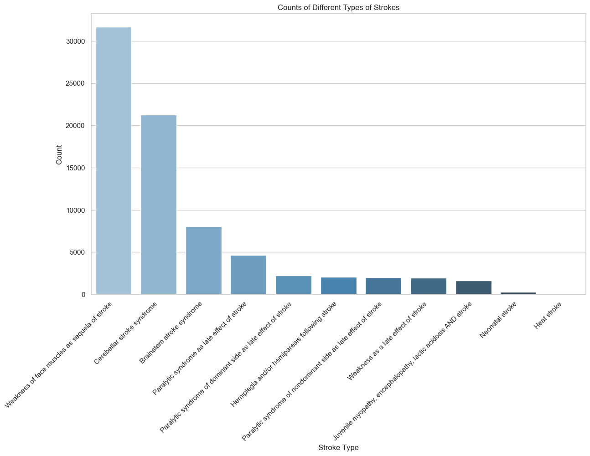

# Initial EDA -

Following are the figures we have plotted as a form of inital level EDA, of the OHDSI Pharmetrics+ Dataset, in context of stroke patients.

<center>
<figure>

<figcaption>Figure 1 <figcaption>
</figure>

<figure>

<figcaption>Figure 2 <figcaption>
</figure>

<figure>

<figcaption>Figure 3 <figcaption>
</figure>
</center>


## Story & Observation - 
1. Starting with Figure 1 we have considered all the patients who had the substring "stroke" (case insensitive) as part of any of the conditions they have been diagnosed with, and plotted the ditribution of all the conditions that matched, indicating number of patients per condition.

2. Realising a shortcoming of our approach from Figure 1, that Heat Strokes will get considered as a part of our cohort as well, we changed our approach to define a patient cohort who have been diagnosed with stroke, by referring the following concept IDs only -
<center>
<figure>

<figcaption>Stroke Concept IDs<figcaption>
</figure>
</center>

3. Creating a cohort of the patients above we proceeded with creating further plots, and as observed **Cerebral Infarction** is the most common stroke that arises out of all the 7 types considered.

4. Gathering more insight on the types of treatments these patients will be undergoing, we decided to explore their visit types, and found a distribution which is heavily biased towards **Inpatient Hospital** and **Outpatient Visits/Outpatient Hospital**. 

## Next Steps -

1. Considering the amount of time invested in getting the environment and Amazon Workspaces needed for accessing OHDSI dataset was quite large, it resulted in us spending a lot of time in self exploration and figuring things out. As a result, more self-exploration efforts will be the next step with this new cohort definition given the 7 concept IDs mentioned above.
2. Communication with the stakeholder regarding our latest findings, and aligning his expectation in terms of the treatment pathway patients are undergoing and it's effectiveness, needs to be more focussed on. 
3. The details of the procedures that stroke patients undergo as a part of post-diagnosis treatment/therapy will be provided by the stakeholder to further help narrow down, or dataset into smaller and more focussed cohorts for analysis. Following this we will be able to include the procedures as a part of our analysis.

## Steps to reproduce the above plots -

1. Figure 1 - 
    ```
    make fig1
    ```
2. Figure 2 - 
    ```
    make fig2
    ```
3. Figure 3 - 
    ```
    make fig3
    ```